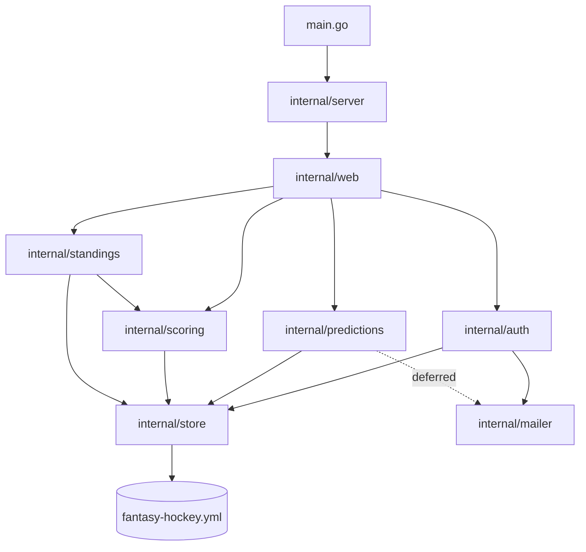
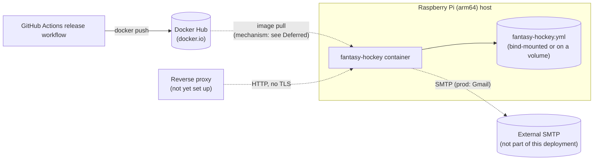

# Architecture Spine — Fantasy Hockey

## Design Paradigm

Layered architecture, three domain layers plus two support roles, one dependency direction.

| Layer | Namespace |
| --- | --- |
| Presentation | `internal/web` (HTTP handlers, `html/template` views, autocomplete widget JS) |
| Feature / domain | `internal/auth`, `internal/predictions`, `internal/scoring`, `internal/standings` |
| Data access | `internal/store` (owns all reads/writes to the single `fantasy-hockey.yml` file) |
| External gateway | `internal/mailer` (SMTP; consumed by `internal/auth` and, once un-deferred, `internal/predictions`) |
| Orchestration | `main.go` + `internal/server` (wiring, HTTP bootstrap; no business logic) |

Dependency direction: presentation depends on feature/domain packages; feature/domain packages depend on `internal/store`; `internal/store` depends on nothing above it. Feature packages never import each other or `internal/web`, **except one sanctioned edge**: `internal/standings` imports `internal/scoring` (one-directional) to consume its computed point values for the Leaderboard's Total column, rather than re-deriving the scoring rules independently (see AD-8).



## Invariants & Rules

### AD-1 — Go toolchain and module identity

- **Binds:** all
- **Prevents:** toolchain/module-path drift between packages built independently.
- **Rule:** Go 1.26.6; module path `github.com/sommerfeld-io/fantasy-hockey`. [ADOPTED — confirmed against `src/go.mod`.]

### AD-2 — `main.go` and `internal/server` are wiring/transport-bootstrap only

- **Binds:** all
- **Prevents:** business logic leaking into the orchestration entrypoint or the HTTP bootstrap layer; cross-cutting request logic (e.g. session-cookie renewal) landing in two different places because its owner was never named.
- **Rule:** all application logic lives in `internal/auth`, `internal/predictions`, `internal/scoring`, `internal/standings`, `internal/store`, or `internal/mailer`. `main.go` only resolves config, opens the data file, and wires dependencies together — no mode dispatch. `internal/server` only bootstraps the HTTP server around whatever `http.Handler` `internal/web.NewServer()` returns — port resolution, graceful shutdown — and never itself examines a request, adds middleware, or imports `internal/auth`/`internal/predictions`/etc. **Session-cookie renewal (AD-11) lives inside `internal/web`**, as middleware wrapping only the authenticated routes on its own `ServeMux` — never in `internal/server`, which has no routing knowledge to distinguish authenticated from public routes. [ADOPTED — `internal/server` named explicitly at spine review to close Finding 6; previously only implied by the Design Paradigm table.]

### AD-3 — Dependency injection via function parameters

- **Binds:** all
- **Prevents:** packages reading real process state (clock, I/O, network, data-file path) directly, which breaks unit-testability.
- **Rule:** side effects are injected as function parameters, never read from global state. [ADOPTED]

### AD-4 — GoDog acceptance tests

- **Binds:** all features
- **Prevents:** acceptance criteria existing only as prose that drifts from actual behavior.
- **Rule:** acceptance criteria are Gherkin `.feature` files under `src/acceptance-tests/features/`, executed via GoDog, for every feature. [ADOPTED — `configure-port.feature`, `view-home-page.feature` already exist.]

### AD-5 — Build-gate tooling

- **Binds:** all
- **Prevents:** lint/complexity/license/vulnerability regressions merging silently.
- **Rule:** the build pipeline runs golangci-lint, gocyclo (complexity limit 10), go-licenses, and govulncheck as gates; a failing gate blocks the build. [ADOPTED]

### AD-6 — Multi-stage Alpine container image

- **Binds:** deployment
- **Prevents:** a bloated or root-running runtime image.
- **Rule:** the Dockerfile stays a multi-stage build (Go build stage, Alpine runtime stage), running as a non-root user. [ADOPTED — Dockerfile is a protected file per project CLAUDE.md; any change needs explicit user sign-off before `bmad-build` touches it.]

### AD-7 — Taskfile orchestration

- **Binds:** all
- **Prevents:** build/lint/test/run commands drifting between ad hoc scripts.
- **Rule:** build, lint, test, and run commands are Taskfile tasks; the root `taskfile.yml` delegates to `src/taskfile.yml` via the `go:` namespace. [ADOPTED]

### AD-8 — Layered architecture with fixed dependency direction

- **Binds:** all
- **Prevents:** feature packages depending on `internal/web`, feature packages depending on each other in ways that bypass `internal/store`, circular dependencies between layers, and — the one case that actually needs a name — `internal/standings` re-deriving `internal/scoring`'s point-calculation logic independently instead of consuming it directly.
- **Rule:** presentation depends on feature/domain packages; feature/domain depends on `internal/store`; `internal/store` depends on nothing above it. `internal/mailer` is depended on only by `internal/auth` and `internal/predictions`. **One sanctioned exception:** `internal/standings` may import `internal/scoring` (one-directional only — `scoring` never imports `standings`) to compute the Leaderboard's Total column from `scoring`'s exported point-calculation functions; this is the only feature-package-to-feature-package import permitted anywhere in the system. [ADOPTED, exception added at spine review]

### AD-9 — A single YAML file as the sole datastore, no database engine

- **Binds:** FR-32 (persistent storage), all data access
- **Prevents:** re-introducing a database engine, a schema-migration tool, or a separate datastore container for three people's picks in one season.
- **Rule:** all persisted state (season, players, teams, deadlines, predictions, results, award finalists, playoff matchups, login codes) lives in one file, `fantasy-hockey.yml`. `internal/store` is the only package that touches it. Only predictions and login codes are written by the app at runtime, in response to a player's own action — everything else is human-maintained (AD-23). **Accepted constraint:** exactly one process writes the file at a time (AD-27) — revisit only if a future version needs more than one writer (see Deferred). [ADOPTED]

### AD-10 — Server-rendered presentation, minimal-dependency stance

- **Binds:** FR-1..FR-2 (login), FR-13..FR-21 (prediction forms), all `internal/web`
- **Prevents:** a JS framework, a separate API+SPA split, a third-party router, an ORM.
- **Rule:** `internal/web` renders HTML server-side with stdlib `html/template`; routing uses stdlib `net/http`'s `ServeMux`. Client-side JS is limited to exactly two sanctioned, vanilla (no framework/library), server-rendered-data-driven responsibilities: the autocomplete widget (AD-19), and disabling a Division's 6th team checkbox / a Conference's 9th (FR-15's "capped live") the moment the client-visible count hits the cap. Both are cosmetic-immediacy only — the server independently re-validates and enforces every cap on submit regardless of what the client allowed, so a JS-disabled or JS-bypassed client can never actually save an over-cap selection. No other client-side JS responsibility exists anywhere in the app. [ADOPTED, live-cap exception added at spine review to close Finding 7]

### AD-11 — Stateless signed-cookie sessions

- **Binds:** FR-3 (session timeout), FR-4 (logout), FR-5 (single-player context)
- **Prevents:** a server-side session table/store, any built-in revocation mechanism.
- **Rule:** a session is an HMAC-signed cookie carrying the player's identity + issued-at; every authenticated request re-issues the cookie, implementing the 30-minute sliding idle timeout; logging out clears/stops re-issuing the cookie. The cookie is always `HttpOnly` and `SameSite=Lax`. `Secure` is set only once the app is told it's behind a TLS-terminating proxy (an env var or trusted-proxy header, decided when AD-14's reverse-proxy work lands) — omitted for now since AD-14 pins the app to plain HTTP today, and setting `Secure` prematurely would silently break login over plain HTTP. No session data is ever written to `fantasy-hockey.yml`. [ADOPTED — matches PRD FR-3/FR-4 and the UX Login flow (full-screen, pre-shell) exactly; cookie attribute policy added at spine review to close Medium finding M-1.]

### AD-12 — Configurable SMTP for all outbound email

- **Binds:** FR-1 (login codes); FR-22 once un-deferred (reminders)
- **Prevents:** a transactional-email SaaS dependency/library; a hardcoded SMTP host that can't be pointed at a local dev capture server.
- **Rule:** outbound email is sent via stdlib `net/smtp`, wrapped in a single `internal/mailer` package called only by `internal/auth` (and, once FR-22 ships, `internal/predictions`). SMTP host, port, username, and password are all read from env vars (`SMTP_HOST`, `SMTP_PORT`, `SMTP_USERNAME`, `SMTP_APP_PASSWORD`) — never hardcoded, and unlike `SESSION_SECRET` (AD-22) **none of them are required at startup**: the app must start successfully with all four unset, so the project's mandatory `task go:run` local-verification workflow (outside docker-compose, per project `CLAUDE.md`) never breaks. If `internal/mailer.Send` is actually called with `SMTP_HOST` unset, it returns an error that the caller logs (per the "no in-app alerting, logs only" convention below) — never a silent no-op, and never an implicit hardcoded fallback host. When `SMTP_USERNAME` is empty, `internal/mailer` skips SMTP AUTH entirely (matches mailpit's no-auth local setup); a non-empty username always authenticates via `smtp.PlainAuth`. No email content beyond login codes and deadline reminders is ever sent — `internal/mailer` has no other call site. Production points these at Gmail (with a real App Password, AD-13); local dev's docker-compose sets them to the capture server (see Structural Seed). [RECONCILED — the prior planning pass hardcoded `smtp.gmail.com:587`; required/optional policy and no-auth convention added at spine review to close Finding 2.]

### AD-13 — SMTP App Password as a runtime secret

- **Binds:** FR-1
- **Prevents:** hardcoding the sending account's credentials or assuming plain password auth.
- **Rule:** in production, the sending Gmail account has 2-Step Verification enabled and an App Password generated manually, outside the app; the App Password is supplied only as a runtime secret/env var (`SMTP_APP_PASSWORD`), never committed. [ADOPTED]

### AD-14 — Plain HTTP behind a reverse proxy added later; arm64 target

- **Binds:** deployment
- **Prevents:** the app terminating TLS itself, or assuming an x86 runtime.
- **Rule:** the app serves plain HTTP (no TLS); TLS/exposure is a reverse proxy's job, set up outside this architecture. The Dockerfile targets arm64 (Raspberry Pi deployment). [ADOPTED]

### AD-15 — Leaderboard and scores computed live, never cached or persisted

- **Binds:** FR-23 (Leaderboard), FR-24 (automatic scoring)
- **Prevents:** a stored score value that can drift from the underlying predictions/results — the stale/miscalculated-score failure mode this rebuild exists to eliminate.
- **Rule:** `internal/scoring` computes every point value on every read, directly from `internal/store`'s in-memory predictions/results/award-finalist data. `internal/standings` computes the Leaderboard's Regular/Playoff/Total columns on every read by calling `internal/scoring`'s exported functions (AD-8's sanctioned exception) — it never re-derives point values itself, and never caches them. No score value is ever written to `fantasy-hockey.yml`. [ADOPTED — `internal/standings` is an internal Go identifier and is unaffected by the PRD/UX rename of "Standings" to "Leaderboard" in user-facing text.]

### AD-16 — RFC3339 timestamps everywhere

- **Binds:** all
- **Prevents:** ambiguous or inconsistently formatted timestamps across packages.
- **Rule:** every *persisted or exchanged* timestamp (deadlines, `issued_at`, `used_at`) is an RFC3339 string, produced as `internal/clock.NowTime().UTC().Format(time.RFC3339)` — every call site formats identically, this exact call, never a bespoke `time.Format` layout. This governs persisted/exchanged timestamps only; a human-facing display string rendered in `internal/web`'s HTML (e.g. a friendlier date format for a Player to read) is a presentation concern, not bound by this AD. [ADOPTED — corrected at spine review: the existing `src/internal/clock/clock.go` exports `NowTime() time.Time`, not `Now() string` as the prior planning pass stated; no RFC3339-string helper exists yet, so this AD pins the formatting call site instead of inventing an unbuilt helper function.]

### AD-17 — ID strategy: UUIDs only for what the app creates, human-readable keys for everything hand-maintained

- **Binds:** FR-1 (login codes), FR-17 (award finalists), FR-33 (NHL Player list), all Prediction FRs, `fantasy-hockey.yml` schema
- **Prevents:** two builders picking different ID shapes for the same entity kind; requiring a human hand-editing `fantasy-hockey.yml` to invent and paste UUIDs; a correct award-finalist pick silently failing to match its recorded result because the prediction side and the results side used different identity vocabularies (name string vs. slug) — the exact "name-typo scoring gap" this rebuild exists to fix.
- **Rule:** entities created at runtime by `internal/store` (Prediction, LoginCode) get an application-generated UUID string. Entities written by hand — Player, Team, Deadline, Result, AwardFinalist-the-winner-record, playoff matchup, **and NHL Player** — use a short, human-readable string key: a player slug (`basti`), a team abbreviation (`TOR`), a deadline key (`preseason`), a round/series key (`round1` and `s1`, nested as `results.series.round1.s1`, never one flat `round1.s1` key), and an **NHL Player slug** (e.g. `mcdavid-connor`), generated once when that player's name is first added to the season's hand-maintained NHL Player list (FR-33) and never regenerated. Every place an NHL Player is referenced — the FR-33 candidate list, the FR-17 autocomplete widget's submitted value (AD-19), a saved `Prediction`'s finalist picks, and the hand-maintained `award_finalists` result section (AD-23) — uses this same slug, never the free-text display name, as the value actually compared for scoring. Nothing a human types by hand is ever a UUID. [ADOPTED, NHL Player identity gap closed at spine review]

### AD-18 — Error wrapping, no custom error envelope

- **Binds:** all
- **Prevents:** an inconsistent error-handling shape across packages.
- **Rule:** errors are wrapped with `fmt.Errorf("context: %w", err)` per Go idiom; no custom error-envelope/response type exists. [ADOPTED]

### AD-19 — Autocomplete data delivered embedded, not via a JSON endpoint

- **Binds:** FR-17 (Player awards autocomplete), FR-33 (canonical team/NHL Player lists)
- **Prevents:** a separate JSON API surface for autocomplete, contradicting the server-rendered stance (AD-10); the same shared widget submitting different value kinds (id vs. display label) at different embedding sites.
- **Rule:** the canonical team list and NHL Player candidate list (for award-finalist autocomplete) are embedded as JSON directly in the rendered page at render time, for the vanilla-JS autocomplete widget to filter client-side — no dedicated `/api/...` endpoint anywhere. Every embedding site uses the identical object shape `{"id": "<id>", "label": "<display name>"}` and the same shared widget script. **The widget always submits the selected option's `id` into its bound form field, never `label`** — `id` is a team abbreviation (`TOR`) or an NHL Player slug (AD-17), and every downstream reader (a saved `Prediction`, `internal/scoring`'s comparison against `results`) compares on that same `id`, never on display text. [ADOPTED, submitted-value rule added at spine review to close Finding 5]

### AD-20 — LoginCode is a tracked entity, hashed, never plaintext

- **Binds:** FR-1, FR-2
- **Prevents:** treating a login code as transient/in-memory state, which can't satisfy "multiple codes may be simultaneously valid per player, each independently expiring."
- **Rule:** `internal/store` persists one login-code entry per issued code (player, `code_hash`, issued-at, used-at nullable); the stored value is `sha256(code)`, never plaintext — validation hashes the submitted code and compares hashes. A code is valid only while unused and within its 10-minute window (FR-2); requesting a new code adds a new entry rather than mutating/replacing an existing one (FR-1). [ADOPTED]

### AD-21 — Import-boundary enforcement via golangci-lint `depguard`

- **Binds:** AD-8
- **Prevents:** the dependency-direction rule existing only as prose a build can silently violate.
- **Rule:** `.golangci.yml` enables `depguard` with rules encoding AD-8's forbidden import edges (including that only `internal/standings` may import `internal/scoring`, never the reverse); a violation fails `task go:lint` (AD-5's build gate), not just code review. [**NOT YET ADOPTED** — corrected at spine review: verified against the actual repo, `.golangci.yml` does not currently enable `depguard` at all. This is a build-time task, not something this architecture pass modifies directly — until it's added, AD-8's dependency-direction rule has no automated enforcement and relies on code review alone. Flagged as a near-term build task, not a Deferred item, given AD-21 exists specifically to prevent that gap.]

### AD-22 — Session-signing secret is a required runtime env var

- **Binds:** AD-11
- **Prevents:** an in-process-generated HMAC secret silently invalidating every session on every container restart.
- **Rule:** the HMAC key signing session cookies is read from a required `SESSION_SECRET` env var at startup; the process fails to start if it's unset — never generated in-process. [ADOPTED]

### AD-23 — Results, deadlines, and playoff matchups are human-maintained; the app only reads them

- **Binds:** FR-8 (deadline enforcement), FR-20 (round unlocking), FR-24 (scoring), PRD §5 Non-Goals
- **Prevents:** building a management/admin UI or an `internal/results`-style write path; any feature package assuming it can write a Result, AwardFinalist, Deadline, or playoff matchup entry.
- **Rule:** award finalists/winners, team results, series results, playoff matchups, each Prediction set's deadline, **the canonical team list, and the NHL Player candidate list (FR-33)** are all written by a human directly editing `fantasy-hockey.yml` — no Go code path ever writes any of them. `internal/predictions` reads deadlines and playoff matchups; `internal/scoring` reads results and award finalists; `internal/web` reads the team/NHL Player lists to embed for autocomplete (AD-19). No package exposes a way to create/modify these sections; `internal/store`'s writers cover only predictions and login codes (AD-9). [ADOPTED, FR-33 lists added at spine review]

### AD-24 — Import-boundary and shared-struct ownership: `internal/store` owns domain entity structs and shared enums

- **Binds:** all feature packages
- **Prevents:** two feature packages independently defining their own `Prediction` (or other shared entity) struct with incompatible shapes, or the same cross-cutting value encoded with different casing/vocabulary in different places.
- **Rule:** `internal/store` exports the canonical Go struct for every entity it owns, matching the YAML shape, with `yaml` struct tags — feature packages import and use these structs as-is. `store.AwardFinalist` **is a struct**, not a bare string — `{Slug string, DisplayName string}` at minimum (per AD-17's NHL Player slug rule) — never a raw `[]string` of names; the illustrative schema in Structural Seed shows the wire shape this maps to. `internal/store` also exports typed constants for every cross-cutting enumeration (e.g. `Prediction.Kind`, `AwardFinalist.Award`). [ADOPTED — renumbered from the source's AD-28; the source's AD-24 (reminder-send mechanics) moved to Deferred below, since FR-22 itself is deferred. AwardFinalist struct shape clarified at spine review to close Finding 4's self-contradiction.]

### AD-25 — Data-file location: env var or CLI flag, flag wins

- **Binds:** AD-9, deployment
- **Prevents:** no way to point the same built binary at a different file (dev/test/prod) without rebuilding or editing a committed file.
- **Rule:** the path to `fantasy-hockey.yml` resolves via a `DATA_FILE` env var or a `--data-file` CLI flag (stdlib `flag`); if both are set, the flag wins. If the resolved path doesn't exist, `internal/store` creates it (AD-26) rather than refusing to start. [ADOPTED]

### AD-26 — First-run bootstrap creates the data file if it doesn't exist

- **Binds:** AD-9, AD-25
- **Prevents:** every feature package assuming the file (and a season within it) already exists, with no code path that ever creates it.
- **Rule:** on startup, if the file at the resolved path doesn't exist, the app creates it with an initial skeleton: current season + the fixed list of players (name + email). Since there's no registration/admin-invite flow, that initial player list must come from an out-of-band mechanism before first run (a hand-authored starter file, or a one-time seed value read only when creating a brand-new file — an implementation choice, not fixed here). Once the file exists, it's the only source of truth for who the players are. [ADOPTED]

### AD-27 — Atomic whole-file writes; single-process, single-writer safety

- **Binds:** AD-9
- **Prevents:** a crash or concurrent write leaving `fantasy-hockey.yml` half-written or corrupted.
- **Rule:** `internal/store` loads the whole file into memory once at startup. Every write updates that in-memory structure under a mutex, then serializes the *entire* file back to disk by writing to a temporary file in the same directory and renaming it over the original — never in place. A multi-field prediction save updates the in-memory structure once and triggers exactly one write-and-rename. Relies on the app being the only process that ever writes the file at once (AD-9) — no locking against a second writer, none expected to exist. [ADOPTED — matches the PRD addendum's independently-logged deferral of a write-queuing mechanism; no conflict.]

### AD-28 — Prediction row granularity: one row per independently-saveable pick

- **Binds:** FR-9 (edit-until-deadline, independent-subset saving), all prediction-entry FRs (FR-13..FR-19), `store.Prediction`
- **Prevents:** two builders choosing incompatible `store.Prediction` cardinalities — fine-grained one-row-per-field vs. coarse-grained one-row-per-set — for features built independently against the same struct.
- **Rule:** `internal/store` holds one `Prediction` row per independently-saveable pick, matching FR-9's "any subset of a set's fields can be saved independently" exactly: one row for the Cup champion pick, one for the Presidents' Trophy pick, one per Division's playoff-team list, one per Division winner, one per award's finalist trio, one per Series (the sole exception where winner + game-count share a single row, per FR-9/FR-19's explicit "save together as one unit"). Every row carries `player_id`, a `kind` discriminator (`store.KindCupChampion`, `store.KindDivisionWinner`, `store.KindSeries`, etc. — AD-24), and kind-specific fields. There is no `Payload` blob and no single row representing a whole Prediction set. [ADOPTED at spine review, closing Finding 3]

### AD-29 — `internal/store` is method-only; reads and writes are both synchronized

- **Binds:** AD-27, AD-9, all `internal/store` callers
- **Prevents:** a feature package reaching past `internal/store`'s API to touch its in-memory structure or mutex directly; a concurrent read (e.g. Leaderboard computation) racing an in-flight write (e.g. a prediction save) — a real, silent Go data race, not just a file-corruption risk.
- **Rule:** `internal/store`'s in-memory structure and its `sync.RWMutex` are never exported — every interaction goes through exported methods, no exception, regardless of how inconvenient a missing query method makes a caller's story (add the method instead). Every read method takes the mutex's read lock (or returns a defensively-copied value) before returning data; every write method takes the write lock before mutating the in-memory structure and triggering AD-27's write-and-rename. [ADOPTED at spine review, closing High finding H-3 and Finding 8]

### AD-30 — Season rollover: one file per season, archived, `DATA_FILE` repointed

- **Binds:** FR-34 (multi-season history), AD-9, AD-25, AD-26
- **Prevents:** two resolutions to "how does a second season's data coexist with the first's" — rotate-the-file vs. grow-one-file-forever — being built independently and incompatibly; FR-34 shipping with no decided data model at all.
- **Rule:** each NHL season gets its own `fantasy-hockey.yml`-shaped file (e.g. `fantasy-hockey-2026-27.yml`). At season rollover, the human running the pool archives the current file and repoints `DATA_FILE` / `--data-file` at a fresh path; AD-26's first-run bootstrap then creates the new season's skeleton in that fresh file. Prior seasons' files are retained on disk/volume as read-only history — there is no in-app cross-season query, no season-selector, and no code path that reads more than one season's file at a time (matches the PRD's explicit v1 scope cut). The `season:` field inside a given file stays a single scalar, not a list — multi-season-ness lives at the filesystem level, not inside the YAML shape. [ADOPTED at spine review, closing Critical finding C-1]

## Consistency Conventions

| Concern | Convention |
| --- | --- |
| Naming | Package names short, lowercase, singular, no underscores: `auth`, `predictions`, `scoring`, `standings`, `mailer`, `store`, `web`, `clock`, `server`. No generic names (`util`, `common`). |
| Data & formats | IDs per AD-17; shared structs/enums exported once from `internal/store`, never redefined per feature (AD-24); RFC3339 dates via `internal/clock.NowTime().UTC().Format(time.RFC3339)` (AD-16); errors via `fmt.Errorf("context: %w", err)` (AD-18). |
| State & secrets | Session: stateless HMAC-signed cookie, sliding 30-minute idle timeout, no server-side session table (AD-11), signing key from required `SESSION_SECRET` (AD-22). Data-file location: `DATA_FILE` env var or `--data-file` flag, flag wins, auto-created if missing (AD-25, AD-26). SMTP: `SMTP_HOST`/`SMTP_PORT`/`SMTP_USERNAME`/`SMTP_APP_PASSWORD` env-only, no secrets committed (AD-12, AD-13). No in-app alerting — failures surface only through externally exported logs, never in-app UI. |

## Stack

| Name | Version | Purpose |
| --- | --- | --- |
| Go | 1.26.6 | language/toolchain |
| `go.yaml.in/yaml/v3` | latest stable | reads/writes `fantasy-hockey.yml` — the maintained successor to the archived `gopkg.in/yaml.v3` (same import surface; verified at spine review) |
| `cucumber/godog` | v0.16.0 | acceptance tests |
| golangci-lint | latest | build-gate tool |
| gocyclo | latest | build-gate tool, complexity limit 10 |
| go-licenses | latest | build-gate tool |
| govulncheck | latest | build-gate tool |
| `net/http` | stdlib | routing, server |
| `html/template` | stdlib | server-rendered views |
| `net/smtp` | stdlib | outbound email |
| `flag` | stdlib | `--data-file` CLI flag (AD-25) |
| mailpit (`axllent/mailpit`) | latest — verify current tag before use | local-dev-only SMTP capture with a web UI; not shipped to production |

No database driver, migration tool, or ORM — by design (AD-9).

## Structural Seed

### Deployment topology

Target host: Raspberry Pi (arm64). Reverse proxy is out of this architecture's scope (AD-14). v1 is one container — no database container, no separate storage container. Image build and publish already exist as a working pipeline (`.github/workflows/release.yml`, protected file — not modified by this spine): on release, the image is built and pushed to Docker Hub (`docker.io`). The Pi host's own update mechanism (pulling a new image) is not yet decided — see Deferred.



`fantasy-hockey.yml` must live on a bind mount or named volume outside the container's writable layer — it's the only copy of every player's predictions and every recorded result. A container restart or rebuild must never wipe it (see Deferred, backups).

### docker-compose shape (local development)

```yaml
services:
  fantasy-hockey:
    environment:
      - SMTP_HOST=mailpit
      - SMTP_PORT=1025
      - SMTP_USERNAME=
      - SMTP_APP_PASSWORD=
      - SESSION_SECRET=...
      - DATA_FILE=/data/fantasy-hockey.yml
    volumes:
      - fantasy-hockey-data:/data
    depends_on:
      - mailpit

  mailpit:
    image: axllent/mailpit:latest   # verify current tag before use
    ports:
      - "8025:8025"   # web UI

volumes:
  fantasy-hockey-data:
```

No `postgres` service, no `pgdata` volume. Production deployment (outside this compose file) overrides `SMTP_HOST`/`SMTP_PORT`/`SMTP_USERNAME`/`SMTP_APP_PASSWORD` to a real Gmail account (AD-12, AD-13).

### Source tree

```text
src/
  main.go                # wiring only
  internal/
    server/              # HTTP server bootstrap: port resolution, graceful shutdown (existing)
    web/                 # presentation: HTTP handlers, html/template views
      static/             # CSS + vanilla autocomplete JS, served via go:embed
    auth/                  # login-code issuance/validation, session cookie
    predictions/            # prediction entry, edit-before-deadline, deadline enforcement
    scoring/                 # scoring engine: awards, team marks, series, cup picks
    standings/                # live Leaderboard computation
    mailer/                    # SMTP delivery (stdlib net/smtp); used by auth (+ predictions once FR-22 ships)
    store/                      # fantasy-hockey.yml data access; writes predictions + login codes, reads everything else
    clock/                       # current time, RFC3339 (existing)
  acceptance-tests/
    features/                     # Gherkin .feature files
```

`internal/server` and `internal/clock` already exist in the current codebase and are ratified here as part of the Orchestration layer and a shared time-abstraction utility respectively — not new packages this spine invents.

### Illustrative data-file shape

Not a final schema — exact field names/nesting are an implementation-time decision (PRD Open Question 3) — but this is the kind of shape `fantasy-hockey.yml` takes, per AD-9/AD-17/AD-20/AD-23:

```yaml
# --- hand-maintained: the app only ever reads these sections (AD-23) ---

season: "2026-27"

players:                           # human-readable slug keys, not UUIDs (AD-17)
    - id: "basti"
      name: "Basti"
      email: "basti@example.com"

teams:
    - id: "TOR"                    # standard team abbreviation, not a UUID (AD-17)
      name: "Toronto Maple Leafs"

deadlines:
    - key: "preseason"
      at: "2026-10-06T19:00:00+02:00"   # Europe/Berlin, per PRD FR-6

results:
    team_marks:
        atlantic: { playoffs: ["TOR", "FLA", "TBL", "BOS"], division_winner: "FLA" }
    presidents_trophy: "DAL"
    stanley_cup_winner: "EDM"
    series:
        round1:                    # round1..round4 = r1, r2, cf, scf
            s1: { winner: "FLA", games: 5 }   # nested: round, then playoff_matchups key -- never a flat "round1.s1" key

award_finalists:                   # AwardFinalist struct: {slug, display_name} -- slug is the compared value (AD-17)
    hart:
        - { slug: "mcdavid-connor", display_name: "Connor McDavid" }
        - { slug: "...", display_name: "..." }
        - { slug: "...", display_name: "..." }

playoff_matchups:
    round2:
        - { a: "FLA", b: "TOR" }   # unlocks Round 2's Prediction set once present (AD-23, FR-20)

# --- app-written at runtime: the only sections internal/store ever writes (AD-9) ---

predictions:
    - id: "3f1a...-uuid"           # application-generated UUID (AD-17)
      player_id: "basti"
      kind: "team_mark"            # store.KindTeamMark et al. (AD-24)

login_codes:
    - player_id: "basti"
      code_hash: "sha256:..."
      issued_at: "2026-09-08T19:00:00+02:00"
      used_at: null
```

## Capability → Architecture Map

| Capability / Area | Lives in | Governed by |
| --- | --- | --- |
| Authentication (FR-1..FR-5) | `internal/auth`, `internal/web` | AD-11, AD-12, AD-13, AD-14, AD-17, AD-20, AD-22 |
| Prediction sets & deadlines (FR-6..FR-12) | `internal/predictions`, `internal/web` | AD-8, AD-10, AD-17, AD-23 |
| Before-the-season & Playoff predictions (FR-13..FR-21) | `internal/predictions`, `internal/web` | AD-8, AD-10, AD-17, AD-19, AD-24 |
| Deadline reminders (FR-22) — deferred | — | see Deferred |
| Scoring & Leaderboard (FR-23..FR-24) | `internal/scoring`, `internal/standings` | AD-8, AD-15, AD-18, AD-24 |
| Compare predictions (FR-25..FR-28) | `internal/predictions`, `internal/web` | AD-8, AD-20 |
| App shell & navigation (FR-29..FR-31) | `internal/web` | AD-10 |
| Persistence & season data (FR-32..FR-34) | `internal/store` | AD-9, AD-17, AD-23, AD-25, AD-26, AD-27, AD-28, AD-29, AD-30 |

## Deferred

- **Deadline reminder emails (FR-22, UJ-4) — the whole feature, not just its scheduling.** Deferred out of MVP during the UX pass (no trigger surface designed). When it's built: send stays synchronous and request-triggered — no ticker, no dedupe log, no goroutine/queue — since sending is an explicit, unlimited-repeat human action, not a repeating automatic tick. A future scheduled/automatic variant would need its own dedupe tracking; not needed at this scale.
- **Backup/restore of `fantasy-hockey.yml`.** With no database, this file *is* the entire season's data. No backup/restore story exists yet; worth solving before real season data that would be painful to lose accumulates.
- **Multiple writer processes.** The whole file-based design assumes a single writer (AD-9, AD-27) — cross-referenced with the PRD addendum's independently-logged "write-queuing mechanism" future consideration, same underlying constraint. Revisit the persistence approach entirely (locking, or a real datastore) only if that assumption is ever broken.
- **Reverse proxy / public exposure / TLS.** Out of this architecture's scope; revisit before the app needs to be reachable from outside the host network.
- **Raspberry Pi image update mechanism.** The image build/publish side is already a working pipeline (Docker Hub via `.github/workflows/release.yml`); how the Pi host actually picks up a new image is not decided — manual `docker compose pull && up -d`, a scheduled puller (e.g. Watchtower), or something else. Low-stakes for a 3-person hobby deployment; decide before the release cadence makes manual pulls annoying.
- **`fantasy-hockey.yml`'s exact field-level schema.** The shape above is illustrative, not binding — final field names/nesting are an implementation-time decision (PRD Open Question 3).
