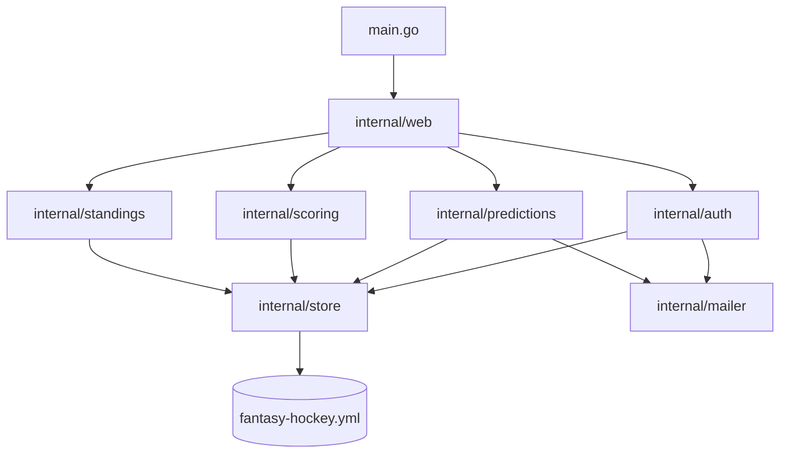
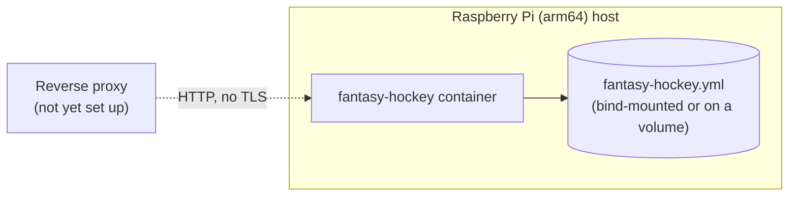

# Fantasy Hockey — Architecture Requirements

This document consolidates the Go and software-design requirements from `_bmad-output/planning-artifacts/architecture/architecture-fantasy-hockey-2026-09-05/ARCHITECTURE-SPINE.md` (and supporting technical decisions repeated in the epic breakdown and PRD), adapted for a from-scratch rebuild. It covers **how** the app is built — language, tooling, layering, persistence approach — not **what** it does; feature scope lives in `assets/requirements.md`.

**One deliberate, overriding change from the earlier planning: there is no database.** All persisted state — the season, every player's name and email, every prediction, and every real-world result recorded against it — lives in a single `fantasy-hockey.yml` file. PostgreSQL, `pgx`, `golang-migrate`, schema migrations, a `postgres` container, and a `pgdata` volume are all removed from this design; every requirement below that referenced them has been rewritten around the single YAML file instead. Everything else — the layered package structure, the build-gate tooling, the session mechanism, the email flow — carries forward largely unchanged, because none of it actually depended on having a database.

**A second, related change: the app has no management/admin UI, and never writes results, deadlines, or playoff matchups** (`assets/requirements.md`, "Results, deadlines & playoff matchups"). Only two things are written by the app itself at runtime — predictions and login codes. Everything else in the file is put there by hand, by whoever has access to the server, editing `fantasy-hockey.yml` directly; the app only ever reads it. This removes the `internal/results` package (and its whole write path) from the design entirely — see AD-23.

---

## 1. Design paradigm

Layered architecture, three layers, one direction — unchanged in shape, only the data-access layer's backing store changes.

| Layer             | Namespace                                                                              |
|-------------------|----------------------------------------------------------------------------------------|
| Presentation      | `internal/web` (HTTP handlers, `html/template` views, the autocomplete widget's JS)    |
| Feature / domain  | `internal/auth`, `internal/predictions`, `internal/scoring`, `internal/standings`      |
| Data access       | `internal/store` (owns all reads/writes to the single `fantasy-hockey.yml` file)       |
| External gateways | `internal/mailer` (Gmail SMTP; consumed by `internal/auth` and `internal/predictions`) |
| Orchestration     | `main.go` (wiring only, no business logic)                                             |

Dependency direction rule: presentation depends on feature/domain packages; feature/domain packages depend on `internal/store`; `internal/store` depends on nothing above it. Feature packages never import `internal/web` or each other directly.



## 2. Architecture decisions

### AD-1 — Go toolchain and module identity

- **Rule:** Go 1.26.6; module path `github.com/sommerfeld-io/fantasy-hockey`.

### AD-2 — `main.go` is wiring-only

- **Rule:** all application logic lives in `internal/` packages; `main.go` only resolves config, opens the data file, and wires dependencies together — no business logic, no mode dispatch.

### AD-3 — Dependency injection via function parameters

- **Rule:** side effects (clock, I/O, network, the data-file path) are injected as function parameters rather than read from global state, so every package stays unit-testable without touching real process state.

### AD-4 — GoDog acceptance tests

- **Rule:** acceptance criteria are expressed as Gherkin `.feature` files under `src/acceptance-tests/features/`, executed via GoDog, for every feature.

### AD-5 — Build-gate tooling

- **Rule:** the build pipeline runs golangci-lint, gocyclo (complexity limit 10), go-licenses, and govulncheck as gates; a failing gate blocks the build.

### AD-6 — Multi-stage Alpine container image

- **Rule:** the Dockerfile stays a multi-stage build (Go build stage, Alpine runtime stage), running as a non-root user.

### AD-7 — Taskfile orchestration

- **Rule:** build, lint, test, and run commands are defined as Taskfile tasks; the root `taskfile.yml` delegates to `src/taskfile.yml` via the `go:` namespace.

### AD-8 — Layered architecture with fixed dependency direction

- **Prevents:** feature packages depending on `internal/web`, feature packages depending on each other in ways that bypass `internal/store`, and circular dependencies between layers.
- **Rule:** presentation (`internal/web`) depends on feature/domain packages; feature/domain packages depend on `internal/store`; `internal/store` depends on nothing above it. `internal/mailer` is depended on only by `internal/auth` and `internal/predictions`.

### AD-9 — A single YAML file as the sole datastore, no database engine

- **Prevents:** re-introducing a database engine, a schema-migration tool, or a separate datastore container for what is, at this scale, three people's picks for one season.
- **Rule:** all persisted state — season, players (name + email), teams, deadlines, predictions, results, award finalists, playoff matchups, login codes — lives in one file, `fantasy-hockey.yml`. `internal/store` is the only package that reads or writes it; no other package touches the filesystem for application data. There is no SQL, no schema migration step, and no second container for storage.
- **What the app actually writes:** only predictions and login codes are written by `internal/store` at runtime, in response to a player's own actions. Everything else in the file — season, players, teams, deadlines, results, award finalists, playoff matchups — is written by a human, directly editing `fantasy-hockey.yml`; the app only ever reads those sections (see AD-23).
- **Constraint this accepts, deliberately:** the design assumes exactly one process ever writes the file at a time (see AD-27). This is fine for the app as scoped — a single container serving three players — and is a known limit to revisit only if a future version ever needs more than one writer process (see [Deferred](#7-deferred--explicitly-out-of-scope-for-now)).

### AD-10 — Server-rendered presentation, minimal-dependency stance

- **Prevents:** a JS framework, a separate API+SPA split, a third-party router, or an ORM.
- **Rule:** `internal/web` renders HTML server-side with stdlib `html/template`; routing uses stdlib `net/http`'s `ServeMux` method+path patterns; the only client-side JS is vanilla JS driving the autocomplete widget.

### AD-11 — Stateless signed-cookie sessions

- **Prevents:** a server-side session table/store, or any built-in revocation mechanism.
- **Rule:** a session is an HMAC-signed cookie carrying the player's identity + issued-at; every authenticated request re-issues the cookie, implementing the 30-minute sliding idle timeout; logging out means the cookie is no longer re-issued/is cleared. No session data is ever written to `fantasy-hockey.yml`.

### AD-12 — Gmail SMTP for all outbound email

- **Prevents:** adding a transactional-email SaaS dependency or library.
- **Rule:** outbound email (login codes, deadline reminders) is sent via stdlib `net/smtp` to `smtp.gmail.com:587` with STARTTLS, wrapped in a single `internal/mailer` package that `internal/auth` and `internal/predictions` both call — no other package sends email directly. No email content beyond login codes and deadline reminders is ever sent.

### AD-13 — Gmail App Password as a runtime secret

- **Prevents:** hardcoding the sending account's credentials or assuming plain password auth.
- **Rule:** the sending Gmail account has 2-Step Verification enabled and an App Password generated manually, outside the app; the App Password is supplied to the app only as a runtime secret/env var, never committed.

### AD-14 — Plain HTTP behind a reverse proxy added later; arm64 target

- **Prevents:** the app terminating TLS itself, or assuming an x86 runtime.
- **Rule:** the app serves plain HTTP (no TLS); TLS/exposure is a reverse proxy's job, set up outside this architecture. The Dockerfile targets arm64 (Raspberry Pi deployment).

### AD-15 — Standings and scores computed live, never cached or persisted

- **Prevents:** a stored score value that can drift from the underlying predictions/results — the stale/miscalculated-score failure mode the whole rebuild exists to eliminate.
- **Rule:** `internal/scoring` and `internal/standings` compute points on every read directly from `internal/store`'s in-memory predictions/results/award-finalist data; no score value is ever written to `fantasy-hockey.yml`.

### AD-16 — RFC3339 timestamps everywhere

- **Rule:** every date/timestamp — deadlines, `issued-at`, `used-at` — is an RFC3339 string, produced via `internal/clock.Now()`.

### AD-17 — ID strategy: UUIDs only for what the app creates, human-readable keys for everything hand-maintained

- **Prevents:** two builders picking different ID shapes for the same kind of entity; requiring someone hand-editing `fantasy-hockey.yml` to invent and paste UUIDs for data they're typing themselves.
- **Rule:** an entity `internal/store` creates itself, at runtime, in response to a player's action — Prediction, LoginCode — gets an application-generated UUID string. Every entity that's instead written by hand directly into the file (Player, Team, Deadline, Result, AwardFinalist, playoff matchup) uses a short, human-readable string key instead — e.g. a player slug (`basti`), a team's standard abbreviation (`TOR`), a deadline key (`preseason`), a round/series key (`round1.s1`). Nothing a human has to type by hand is ever a UUID.

### AD-18 — Error wrapping, no custom error envelope

- **Rule:** errors are wrapped with `fmt.Errorf("context: %w", err)` per Go idiom; no custom error-envelope/response type exists.

### AD-19 — Autocomplete data delivered embedded, not via a JSON endpoint

- **Prevents:** a separate JSON API surface being introduced for autocomplete, which would contradict the server-rendered, no-API-split stance (AD-10).
- **Rule:** the canonical team and player candidate lists are embedded as JSON directly in the rendered page (server-side, at render time) for the vanilla-JS autocomplete widget to filter client-side — no dedicated `/api/...` JSON endpoint exists anywhere in the app. Every embedding site uses the identical object shape `{"id": "<id>", "label": "<display name>"}` and the same shared widget script.

### AD-20 — LoginCode is a tracked entity, hashed, never plaintext

- **Prevents:** treating a login code as transient/in-memory state, which cannot satisfy the rule that multiple codes may be simultaneously valid per player, each independently expiring.
- **Rule:** `internal/store` persists one login-code entry per issued code (player, `code_hash`, issued-at, used-at nullable) in `fantasy-hockey.yml`; the stored value is `sha256(code)`, never the plaintext code — validation hashes the submitted code and compares hashes. A code is valid only while unused and within its validity window; requesting a new code adds a new entry rather than mutating/replacing an existing one.

### AD-21 — Import-boundary enforcement via golangci-lint `depguard`

- **Prevents:** the dependency-direction rule (AD-8) existing only as prose that a build can silently violate.
- **Rule:** `.golangci.yml` enables the `depguard` linter with rules encoding AD-8's forbidden import edges (feature packages never import `internal/web`); a violation fails `task go:lint` (AD-5's build gate), not just code review.

### AD-22 — Session-signing secret is a required runtime env var

- **Prevents:** an in-process-generated HMAC secret silently invalidating every session (logging every player out) on every container restart.
- **Rule:** the HMAC key used to sign session cookies (AD-11) is read from a required `SESSION_SECRET` env var at startup; the process fails to start if it is unset — it is never generated in-process.

### AD-23 — Results, deadlines, and playoff matchups are human-maintained; the app only reads them

- **Prevents:** building a management/admin UI or a `internal/results`-style write path that `assets/requirements.md` deliberately does without ("Results, deadlines & playoff matchups"); any feature package assuming it can write a Result, AwardFinalist, Deadline, or playoff matchup entry.
- **Rule:** award finalists/winners, team results (playoff qualifiers, division winners, Presidents' Trophy, Stanley Cup winner), series results, playoff matchups, and each prediction set's deadline are all written by a human, directly editing `fantasy-hockey.yml` — no Go code path in this app ever writes any of them. `internal/predictions` reads deadlines (for the lock check, AD-8) and playoff matchups (for round-gating); `internal/scoring` and `internal/standings` read results and award finalists (AD-15). No package — not even `internal/store`'s own write methods — exposes a way to create or modify these sections; `internal/store`'s writers cover only predictions and login codes (AD-9).

### AD-24 — Reminder send is synchronous and request-triggered — no ticker, no dedupe log

- **Prevents:** wiring a background process or dedupe table that isn't needed at this scale.
- **Rule:** clicking "Send reminder email" calls an `internal/web` handler that synchronously invokes `internal/predictions`' "who hasn't completed this deadline" check and sends via `internal/mailer` — within the same HTTP request, no goroutine, no queue, no scheduled ticker. Nothing about a sent reminder is recorded in `fantasy-hockey.yml` — every click independently re-evaluates completion status and sends fresh, since sending is an explicit, unlimited-repeat human action, not a repeating automatic tick.

### AD-25 — Data-file location: env var or CLI flag, flag wins

- **Prevents:** no way to point the same built binary at a different file (dev/test/prod) without rebuilding or editing a committed file.
- **Rule:** the path to `fantasy-hockey.yml` is resolved two ways: a `DATA_FILE` env var, or a `--data-file` CLI flag (stdlib `flag`, no third-party CLI/config library). If both are set, the flag wins. Unlike the earlier database-connection rule this replaces, there is nothing to fail fast about: if the resolved path doesn't exist, `internal/store` creates it (see AD-26) rather than refusing to start.

### AD-26 — First-run bootstrap creates the data file if it doesn't exist

- **Prevents:** every feature package assuming the file (and a season within it) already exists, with no code path that ever creates it.
- **Rule:** on startup, if the file at the resolved path doesn't exist, the app creates it with an initial skeleton: the current season and the fixed list of players (name + email). Because there is no registration/admin-invite flow ([`assets/requirements.md`](requirements.md)), that initial player list has to come from somewhere out-of-band before first run — either a hand-authored starter file deployed alongside the app, or a one-time-only seed value (e.g. env vars read only when creating a brand-new file, never again afterward). Which of those two this build uses is an implementation choice, not fixed here; either way, once the file exists, it is the only source of truth for who the players are — nothing about player identity is re-read from the environment on every startup.

### AD-27 — Atomic whole-file writes; single-process, single-writer safety

- **Prevents:** a crash or concurrent write leaving `fantasy-hockey.yml` half-written or corrupted — this design's equivalent of a database transaction.
- **Rule:** `internal/store` loads the whole file into memory once at startup. Every write updates that in-memory structure under a mutex, then serializes the *entire* file back to disk by writing to a temporary file in the same directory and renaming it over the original — never writing in place. A multi-field prediction save (e.g. a player's whole division-picks form, several teams selected at once) updates the in-memory structure once and triggers exactly one write-and-rename, so it can never land half-saved. This relies on the app being the only process that ever writes the file at once (see AD-9's accepted constraint) — there is no locking against a second writer process, because none is expected to exist. Only predictions and login codes are ever written this way (AD-9, AD-23) — results, deadlines, and playoff matchups are never touched by this path.

### AD-28 — `internal/store` owns domain entity structs and shared enums

- **Prevents:** two feature packages independently defining their own `Prediction` (or other shared entity) Go struct with incompatible shapes, or the same cross-cutting value encoded with different casing/vocabulary in different places.
- **Rule:** `internal/store` exports the canonical Go struct for every entity it owns (`store.Prediction`, `store.Player`, `store.AwardFinalist`, etc.), matching the YAML shape, with `yaml` struct tags — feature packages import and use these structs as-is; no feature package redefines its own version of a store-owned entity. `internal/store` also exports typed constants for every cross-cutting enumeration (e.g. `Prediction.Kind`, `AwardFinalist.Award`) — no feature package re-derives its own string literal for a value it doesn't own.

## 3. Consistency conventions

| Concern         | Convention                                                                                                                                                                                                                                                                                                                                                                                                                                                                                               |
|-----------------|----------------------------------------------------------------------------------------------------------------------------------------------------------------------------------------------------------------------------------------------------------------------------------------------------------------------------------------------------------------------------------------------------------------------------------------------------------------------------------------------------------|
| Naming          | Package names are short, lowercase, singular, no underscores: `auth`, `predictions`, `scoring`, `standings`, `mailer`, `store`, `web`, `clock`. No generic package names (`util`, `common`).                                                                                                                                                                                                                                                                                                             |
| Data & formats  | IDs: application-generated UUID strings only for what the app creates at runtime (Prediction, LoginCode); human-readable string keys for everything hand-maintained in the file (Player, Team, Deadline, Result, AwardFinalist, playoff matchup — AD-17). Shared entity structs and enum constants are exported once from `internal/store`, never redefined per feature (AD-28). Dates/timestamps: RFC3339 strings via `internal/clock.Now()` (AD-16). Errors: `fmt.Errorf("context: %w", err)` (AD-18). |
| State & secrets | Session/auth: stateless HMAC-signed cookie, sliding 30-minute idle timeout, no server-side session table (AD-11), signing key from a required `SESSION_SECRET` env var (AD-22). Data file location: `DATA_FILE` env var or `--data-file` flag, flag wins, auto-created if missing (AD-25, AD-26). `SMTP_USERNAME`/`SMTP_APP_PASSWORD` as env vars only — no secrets committed (AD-13). No in-app alerting: failures are surfaced only through externally exported logs, never through in-app UI.         |

## 4. Stack

| Name             | Version                       | Purpose                              |
|------------------|-------------------------------|--------------------------------------|
| Go               | 1.26.6                        | language/toolchain                   |
| gopkg.in/yaml.v3 | latest stable                 | reads/writes `fantasy-hockey.yml`    |
| cucumber/godog   | v0.16.0 (already in `go.mod`) | acceptance tests                     |
| golangci-lint    | latest                        | build-gate tool                      |
| gocyclo          | latest                        | build-gate tool, complexity limit 10 |
| go-licenses      | latest                        | build-gate tool                      |
| govulncheck      | latest                        | build-gate tool                      |
| net/http         | stdlib                        | routing, server                      |
| html/template    | stdlib                        | server-rendered views                |
| net/smtp         | stdlib                        | outbound email                       |

No database driver, no migration tool, and no ORM appear in this stack — that is the point of AD-9.

## 5. Structural seed

### Deployment topology

Target host: Raspberry Pi (arm64). Reverse proxy is out of scope here (AD-14). **v1 is one container** — no database container, no separate storage container.



`fantasy-hockey.yml` must live on a bind mount or named volume outside the container's writable layer — it is the *only* copy of every player's predictions and every recorded result. Losing it loses the season. A container restart or rebuild must never wipe it (see also [Deferred](#7-deferred--explicitly-out-of-scope-for-now) on backups).

### docker-compose shape

```yaml
services:
  fantasy-hockey:
    environment:
      - SMTP_USERNAME=...
      - SMTP_APP_PASSWORD=...
      - SESSION_SECRET=...
      - DATA_FILE=/data/fantasy-hockey.yml
    volumes:
      - fantasy-hockey-data:/data

volumes:
  fantasy-hockey-data:
```

No `postgres` service, no `pgdata` volume, no `depends_on` — the app has no other service to wait on.

### Source tree

```text
src/
  main.go                # wiring only
  internal/
    web/                 # presentation: HTTP handlers, html/template views
      static/             # CSS + vanilla autocomplete JS, served via go:embed
    auth/                  # login-code issuance/validation, session cookie
    predictions/            # prediction entry, edit-before-deadline, deadline enforcement, reminder check
    scoring/                 # scoring engine: awards, team marks, series, cup picks
    standings/                # live standings computation
    mailer/                    # Gmail SMTP delivery (stdlib net/smtp); used by auth + predictions
    store/                      # fantasy-hockey.yml data access; writes predictions + login codes, reads everything else
    clock/                       # current time, RFC3339
  acceptance-tests/
    features/                     # Gherkin .feature files
```

### Illustrative data-file shape

Not a final schema — the exact field names/nesting are an implementation detail to settle during build — but this is the kind of shape `fantasy-hockey.yml` takes, per AD-9/AD-17/AD-20/AD-23:

```yaml
# --- hand-maintained: the app only ever reads these sections (AD-23) ---

season: "2026-27"

players:                           # human-readable slug keys, not UUIDs (AD-17)
    - id: "basti"
      name: "Basti"
      email: "basti@example.com"

teams:
    - id: "TOR"                    # standard team abbreviation, not a UUID (AD-17)
      name: "Toronto Maple Leafs"

deadlines:
    - key: "preseason"
      at: "2026-10-06T19:00:00Z"

results:
    team_marks:
        atlantic: { playoffs: ["TOR", "FLA", "TBL", "BOS"], division_winner: "FLA" }
        # ... one entry per division
    presidents_trophy: "DAL"
    stanley_cup_winner: "EDM"
    series:
        round1.s1: { winner: "FLA", games: 5 }
        # ... one entry per concluded series

award_finalists:
    hart: ["...", "...", "..."]
    # ... one entry per award

playoff_matchups:
    round2:
        - { a: "FLA", b: "TOR" }
        # ... unlocks Round 2's prediction set once present (AD-23)

# --- app-written at runtime: the only sections internal/store ever writes (AD-9) ---

predictions:
    - id: "3f1a...-uuid"           # application-generated UUID (AD-17)
      player_id: "basti"
      kind: "team_mark"            # store.KindTeamMark et al. (AD-28)
      # ... kind-specific fields

login_codes:
    - player_id: "basti"
      code_hash: "sha256:..."
      issued_at: "2026-09-08T19:00:00Z"
      used_at: null
```

## 6. Capability → architecture map

| Capability / area                            | Lives in                                                         | Governed by                              |
|----------------------------------------------|------------------------------------------------------------------|------------------------------------------|
| Authentication                               | `internal/auth`, `internal/web`                                  | AD-11, AD-13, AD-14, AD-17, AD-20, AD-22 |
| Enter predictions                            | `internal/predictions`, `internal/web`                           | AD-8, AD-10, AD-17, AD-19, AD-28         |
| Deadline enforcement & reminders             | `internal/predictions`, `internal/web`                           | AD-8, AD-12, AD-13, AD-23, AD-24         |
| Predictions visibility                       | `internal/predictions`, `internal/web`                           | AD-8, AD-20                              |
| Results, deadlines & playoff matchups (read) | `internal/predictions`, `internal/scoring`, `internal/standings` | AD-9, AD-17, AD-23                       |
| Scoring engine                               | `internal/scoring`                                               | AD-8, AD-15, AD-18, AD-28                |
| Standings                                    | `internal/standings`                                             | AD-8, AD-15, AD-20                       |

## 7. Deferred / explicitly out of scope for now

Carried forward from the earlier planning, still valid ideas, just not built now:

- **Scheduled/automatic reminder emails** on a ticker, instead of the manual "Send reminder email" trigger (AD-24). Would need its own dedupe tracking to avoid re-emailing on every tick — deliberately not built now since it isn't needed at this scale.
- **Backup/restore of `fantasy-hockey.yml`.** With no database, this file *is* the entire season's data — more important to get right than the earlier plan's Postgres-volume-backup afterthought. No backup/restore story exists yet; worth solving before real season data that would be painful to lose accumulates.
- **Multiple writer processes.** The whole file-based design assumes a single process writes `fantasy-hockey.yml` (AD-9, AD-27). Revisit the persistence approach entirely (locking, or a real datastore again) if that assumption is ever broken.
- **Reverse proxy / public exposure / TLS.** Out of this architecture's scope; revisit before the app needs to be reachable from outside the host network.
